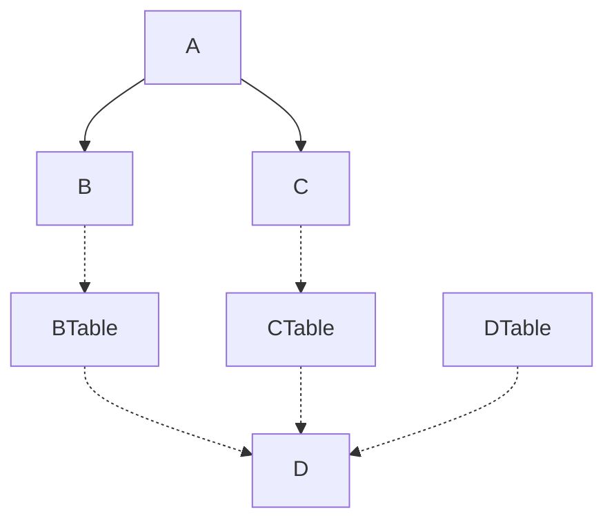
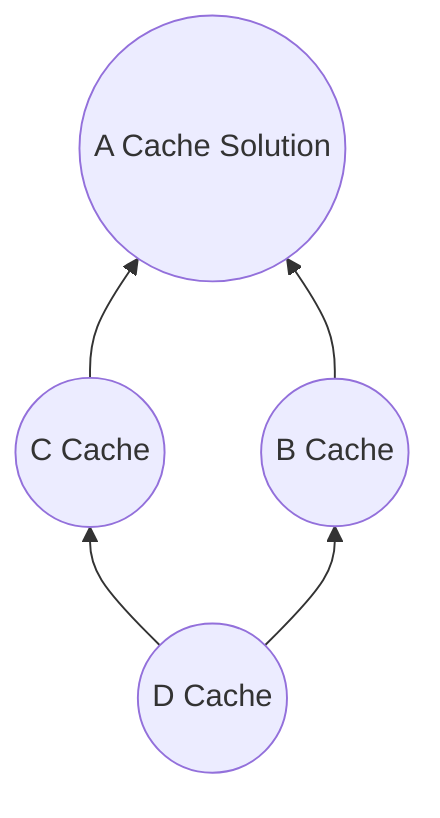

# Introduction to Dynamic Programming

---

Dynamic Programming (DP) is a powerful optimization technique for solving complex problems by breaking them down into simpler, overlapping subproblems. By storing and reusing the solutions to these subproblems, DP avoids redundant calculations, leading to more efficient algorithms.
### Key Concepts

1. **Overlapping Subproblems:** DP is most effective when the solution to a problem can be derived from the solutions to its smaller subproblems, and these subproblems share common elements. This characteristic allows DP to store and reuse solutions, preventing redundant calculations.
	```mermaid
	  graph TD;
	    A-->B;
	    A-->C;
	    B-->D;
	    C-->D;
	```
	This shows how solving the overall problem A depends on solving subproblems B and C, which both require solving subproblem D. Without caching, D would be recomputed redundantly.

2. **Optimal Substructure:** DP problems exhibit optimal substructure, meaning that the optimal solution to a problem can be constructed from optimal solutions to its subproblems. This property allows DP to build up the final solution incrementally.
	```mermaid
	graph TD;
	   A-->B;
	   A-->C;
	   B-->D;
	   C-->D;
	   A(Overall<br>Optimal Solution)-->D(Optimal Subsolution);
	```
	The optimal overall solution A contains within it optimal sub solutions B, C, and D. By caching sub solutions we can build up the overall optimal solution.
## Fibonacci Numbers Example

The Fibonacci sequence is a classic example where DP shines. In its naive recursive implementation, calculating the nth Fibonacci number involves redundant computations of smaller Fibonacci numbers:

```
F(n) = F(n-1) + F(n-2), where F(0) = 0 and F(1) = 1
```

DP eliminates this redundancy by storing the results of smaller Fibonacci numbers in a table or array, preventing their recalculation.
- No of states = O$(2^N)$
- Time complexity  = O(1)

## Recursion vs. Dynamic Programming

| Feature             | Recursion                                                  | Dynamic Programming                                      |
| :------------------ | :--------------------------------------------------------- | :------------------------------------------------------- |
| Subproblem Handling | Repeatedly solves the same subproblems                     | Stores and reuses subproblem solutions                   |
| Time Complexity     | Exponential due to redundant calculations                  | Polynomial due to efficient reuse of solutions           |
| Memory Usage        | Lower due to no storage of intermediate results            | Higher due to storage of subproblem solutions in a table |
| Approach            | Top-down (starts with the main problem and breaks it down) | Bottom-up (starts with the smallest subproblems)         |

## Stair Climbing Problem

Consider the problem of counting the number of ways to reach the nth stair by climbing either 1 or 2 stairs at a time. A recursive solution would involve redundant calculations, as shown below:

```cpp
int countWays(int n) {
    if (n <= 1) return 1; 
    return countWays(n-1) + countWays(n-2);
}
```

DP can optimize this solution by storing the number of ways to reach each stair in an array, eliminating redundant calculations:

```cpp
int countWays(int n) {
    int dp[n+1];
    dp[0] = dp[1] = 1;
    for (int i = 2; i <= n; i++) {
        dp[i] = dp[i-1] + dp[i-2];
    }
    return dp[n];
}
```
Now we have polynomial time complexity by caching subproblems.

## DP Problem Solving Approaches

There are two main approaches to solving dynamic programming problems: top-down and bottom-up.

1. **Top-down with Memoization** :  In a top-down approach, we start by solving the overall problem and break it down into smaller subproblems. We then solve these subproblems as needed, caching their solutions so that we don't have to recompute them if they are needed again. This is called memoization.

When solving problem A we lookup/store solutions for subproblems B and C in their respective tables before recursing.

2. **Bottom-up by filling up cache/lookup table** : In a bottom-up approach, we start by solving the smallest subproblems and work our way up to the overall problem. We solve each subproblem only once and cache its solution so that we can use it to solve larger subproblems. This is also known as tabulation.

We start by solving and caching subproblem D before using it to fill tables for higher level subproblems, ultimately reaching overall problem.

## Greedy vs. Dynamic Programming

While both greedy and DP algorithms aim to find optimal solutions, they differ in their approach. Greedy algorithms make locally optimal choices at each step, hoping to find a global optimum. DP, on the other hand, considers all possible choices and selects the optimal one based on the solutions to subproblems.

Here are some common dynamic programming problems that you can practice: 
- **Fibonacci Numbers**: Given a sequence of numbers where each number is the sum of the previous two, find the nth number in the sequence.
- **Stair Problem**: Given a set of stairs with different heights, find the number of ways to climb to the top of the stairs.
- **Longest Increasing Subsequence**: Given an array of numbers, find the longest subsequence that is sorted in increasing order.
- **Edit Distance**: Given two strings, find the minimum number of operations (insertions, deletions, or substitutions) needed to transform one string into the other.

## Party Problem

You want to invite friends to a party within a budget by choosing those that maximize fun.

Greedy approach - locally choose friends with max fun/cost at each step.

DP gives optimal solution by considering all combos within the budget.

> [!TIP] Summary
> - Useful for optimization problems with overlapping subproblems 
> - Avoid exponential time complexity via subproblem caching
> - Build solutions using cached subproblems (optimal substructure)
> - Top-down with memoization or bottom-up filling cache table
> - Contrast with greedy - exhaustive optimal vs locally optimal 

---
## Resources

To delve deeper into Dynamic Programming, you can explore the following resources:

- **Books:**
    - "Introduction to Algorithms" by Cormen, Leiserson, Rivest, and Stein
    - "Dynamic Programming and Optimal Control" by Dimitri P. Bertsekas
- **Online Courses:**
    - "Algorithms, Part II" by Princeton University on Coursera
    - "Dynamic Programming" by University of California, San Diego on edX
- **Websites:**
    - GeeksforGeeks - Dynamic Programming
    - LeetCode - Dynamic Programming section

By mastering Dynamic Programming, you'll gain a valuable tool for solving a wide range of optimization problems efficiently.