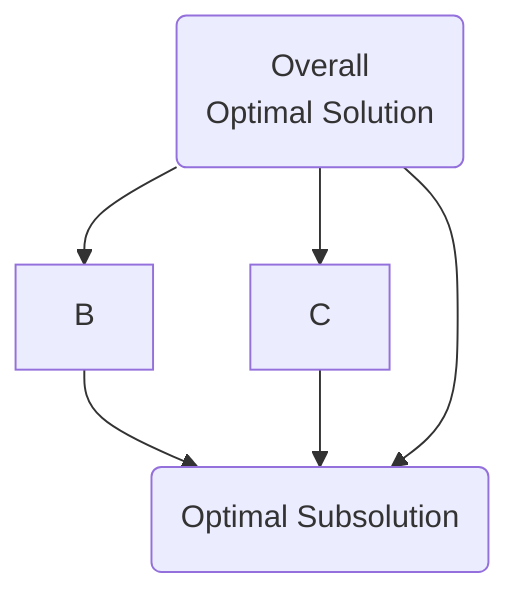
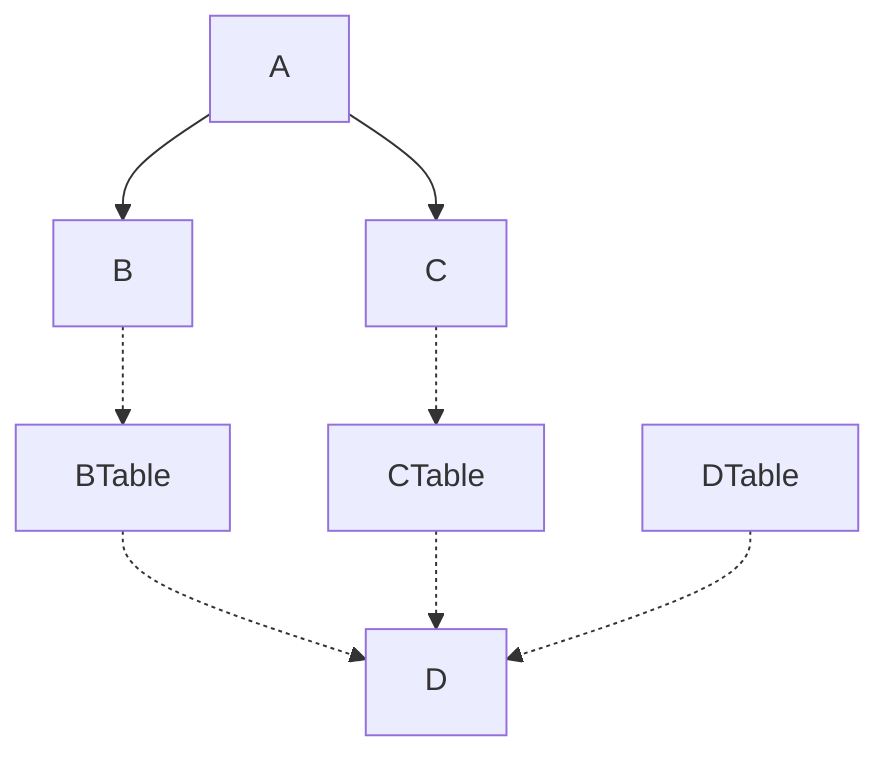
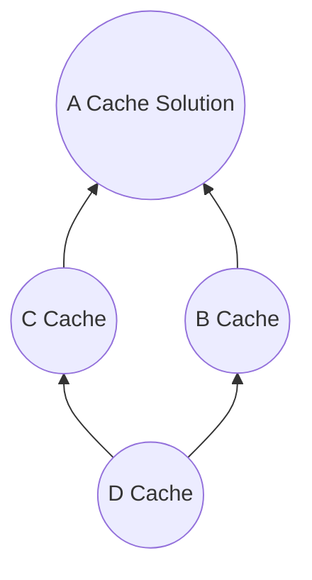

# Introduction

Dynamic Programming is an optimization technique used to solve problems by breaking them down into simpler subproblems. It is effective when subproblems overlap - meaning the solution to one subproblem is needed to solve another. This allows us to cache and reuse solutions instead of recomputing them.

## Recursion vs Dynamic Programming

- Recursion solves problems by reducing them to simpler versions without caching. This can lead to exponential time complexity due to repeated subproblem solving. 
- Dynamic Programming caches intermediate subproblem solutions, allowing polynomial time complexity by avoiding recomputation of overlapping subproblems.

## What is Dynamic Programming

- Break down problem into simpler overlapping subproblems
- Cache solutions to these subproblems in a table
- Build solution to overall problem using cached subproblem solutions
- Avoid recomputing solutions by lookup up cached subproblems first

Characteristics:
- Overlapping Subproblems

This shows how solving the overall problem A depends on solving subproblems B and C, which both require solving subproblem D. Without caching, D would be recomputed redundantly.

- Optimal Substructure

The optimal overall solution A contains within it optimal subsolutions B, C, and D. By caching subsolutions we can build up the overall optimal solution.

## Stair Problem 

Problem: Count number of ways to reach Nth stair when you can climb 1 or 2 stairs at a time.

```cpp
int countWays(int n) {
    if (n == 1) return 1; 
    if (n == 2) return 2;
    return countWays(n-1) + countWays(n-2);
}
```

The above recursive solution has exponential complexity due to recomputation of same subproblems.

We can use dynamic programming to cache subproblem solutions in a table.

```cpp
int lookup[100] = {0};

int countWays(int n) {
    if(lookup[n] > 0) 
        return lookup[n];
    if(n == 1) 
        return 1;
    if(n == 2)
        return 2;
        
    lookup[n] = countWays(n-1) + countWays(n-2);
    return lookup[n];
} 
```
Now we have polynomial time complexity by caching subproblems.

## DP Problem Solving Approaches

1. Top-down with Memoization 

When solving problem A we lookup/store solutions for subproblems B and C in their respective tables before recursing.

2. Bottom-up by filling up cache/lookup table

We start by solving and caching subproblem D before using it to fill tables for higher level subproblems, ultimately reaching overall problem.

## Greedy vs Dynamic Programming

Greedy algorithms make locally optimal choices to come up with a globally optimal solution. Issues:
- Greedy choices may conflict 
- May not check previously eliminated choices
- Not exhaustive

Dynamic programming checks all possible solutions exhaustively within given constraints to find globally optimal solution.

## Party Problem

You want to invite friends to a party within a budget by choosing those that maximize fun.

Greedy approach - locally choose friends with max fun/cost at each step.

DP gives optimal solution by considering all combos within the budget.

## Summary

- Useful for optimization problems with overlapping subproblems 
- Avoid exponential time complexity via subproblem caching
- Build solutions using cached subproblems (optimal substructure)
- Top-down with memoization or bottom-up filling cache table
- Contrast with greedy - exhaustive optimal vs locally optimal 
